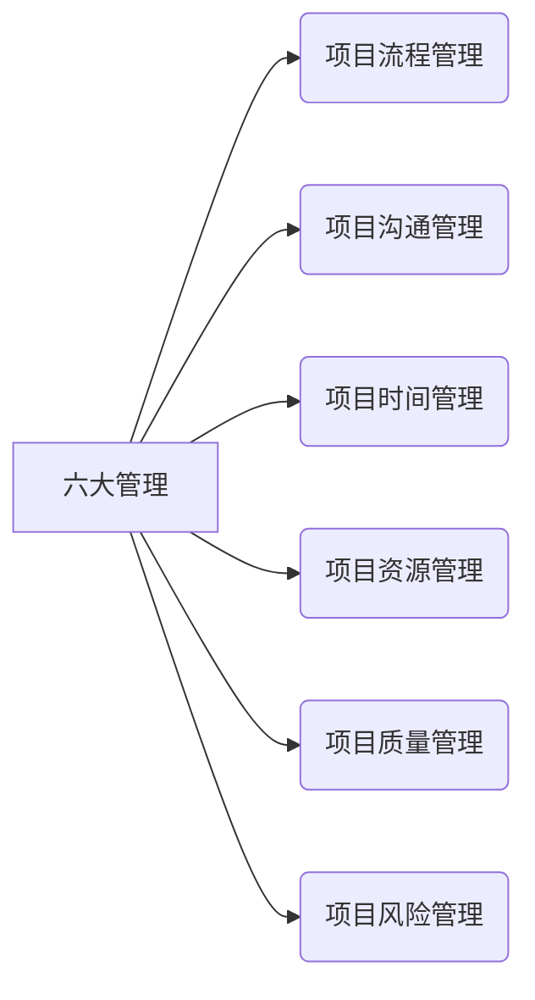

---
layout:center
class:'siwei'
---
# 项目六大管理

```mermaid
graph LR
A[六大管理] -->B(项目流程管理)
          A-->C(项目沟通管理)
          A-->D(项目时间管理)
          A-->E(项目资源管理)
          A-->F(项目质量管理)
          A-->G(项目风险管理)
```

